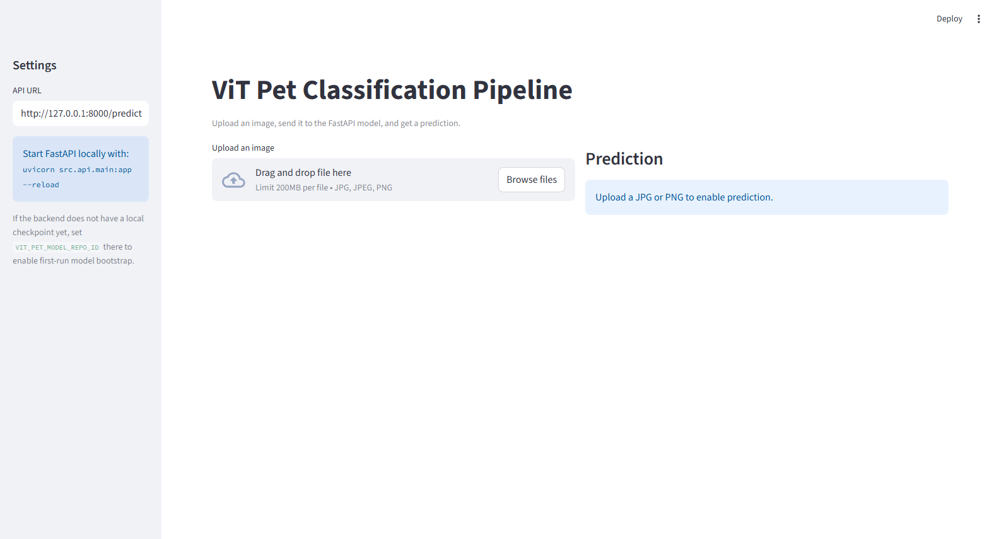

# ViT Pet Classification Pipeline

End-to-end computer-vision delivery path for cats-vs-dogs classification: data checks, Vision Transformer fine-tuning, FastAPI inference, CLI prediction, and a Streamlit review UI.



## What this demonstrates

- A practical computer-vision delivery path, not only a notebook experiment.
- Separate training, inference, API, and UI modules.
- Public-repo posture: no datasets, model weights, `.env` files, or private artifacts committed.
- Lightweight CI tests that validate inference/bootstrap helper behavior without requiring model weights.

## Portfolio Role

This is a supporting ML-delivery project. Its current public value is the engineering boundary around a vision model: training scripts, checkpoint resolution, FastAPI serving, CLI prediction, and a Streamlit review UI without committing private datasets or model weights.

It should become a flagship ML project only after a project-owned checkpoint is published with a reproducible evaluation artifact. Until then, the honest demo is the safe empty-state UI plus tests that prove the delivery surfaces can run without private artifacts.

## Tech stack
- Hugging Face Transformers (ViT) on PyTorch
- NumPy and pandas for data handling
- FastAPI for the inference endpoint
- Streamlit for the optional UI
- Git for version control

## Repository posture

- `LICENSE` and `SECURITY.md` are included for public sharing.
- CI runs lightweight tests that do not require shipping model weights.
- Model artifacts and datasets stay out of version control on purpose.
- The repo supports local checkpoints first and an optional first-run bootstrap path for a published fine-tuned model.

## Reviewer walkthrough

For a safe review without private datasets or model weights:

1. Read the public boundaries in `SECURITY.md`.
2. Run `pytest` to verify the inference/bootstrap helper layer.
3. Inspect `src/training/` for the data inspection, fine-tuning, and evaluation path.
4. Inspect `src/api/main.py`, `src/inference/predict.py`, and `src/ui/app.py` for the delivery surfaces.
5. Launch the UI with `streamlit run src/ui/app.py` to verify the clean upload flow.

Prediction screenshots are intentionally not shipped until a project-owned public checkpoint is published or a local checkpoint is trained in `models/vit_catsdogs`.

## Next Flagship Step

To promote this from supporting project to stronger portfolio project:

1. Train or publish a project-owned checkpoint.
2. Regenerate metrics from a reproducible evaluation run.
3. Add a model card with dataset source, label policy, limitations, and evaluation date.
4. Capture one prediction screenshot from that owned checkpoint.
5. Keep the no-private-artifact rule: `data/`, `models/`, `.cache/`, and local outputs stay ignored unless a curated public artifact is intentionally released.

## Directory layout
```
vit-pet-classification-pipeline/
|- data/             # (ignored) labels.csv and images/
|- models/           # (ignored) saved fine-tuned model/processor
|- src/
|  |- training/      # inspect_data.py, train_vit.py, eval_vit.py
|  |- inference/     # bootstrap.py, predict.py (CLI helper)
|  |- api/           # main.py (FastAPI /predict)
|  |- ui/            # app.py (Streamlit UI)
|- assets/           # sanitized screenshots
|- requirements.txt
|- .gitignore
`- README.md
```

## Installation
1. Clone or extract into `vit-pet-classification-pipeline`.
2. (Recommended) Create and activate a virtual env:
   ```
   python -m venv .venv
   .\.venv\Scripts\Activate.ps1   # PowerShell
   ```
3. Install dependencies:
   ```
   pip install -r requirements.txt
   ```
   Optional editable install for local development:
   ```
   pip install -e .[dev]
   ```
4. Choose one model path:
   - local training path: train into `models/vit_catsdogs`
   - bootstrap path: set `VIT_PET_MODEL_REPO_ID` to a published fine-tuned checkpoint so the API/CLI can download it on first run
5. Add your dataset under `data/` if you plan to train locally:
   - `data/labels.csv` with filename and label columns (defaults: `image_name`, `label`)
   - `data/images/` containing the referenced images

## Usage
- Inspect data paths:
  ```
  python src/training/inspect_data.py
  ```
- Train the model:
  ```
  python src/training/train_vit.py --data-dir data --output-dir models/vit_catsdogs
  ```
- Or bootstrap from a published fine-tuned checkpoint at runtime:
  ```
  $env:VIT_PET_MODEL_REPO_ID="<published-fine-tuned-checkpoint>"
  uvicorn src.api.main:app --reload
  ```
- Evaluate a local checkpoint:
  ```
  python src/training/eval_vit.py --data-dir data --model-dir models/vit_catsdogs
  ```
- Run the API:
  ```
  uvicorn src.api.main:app --reload
  ```
- Launch the Streamlit UI:
  ```
  streamlit run src/ui/app.py
  ```
- CLI prediction:
  ```
  python src/inference/predict.py --image-path data/images/0.jpg
  ```

## Notes
- Defaults expect labels `cat` and `dog`; adjust flags if your CSV differs.
- The classifier head is reinitialized for 2 classes; the mismatched-size warning is expected.
- `data/`, `models/`, `.cache/`, and `.venv/` are ignored to keep the repo lean.
- If `models/vit_catsdogs` is missing, the API and CLI can bootstrap from `VIT_PET_MODEL_REPO_ID`.
- This repo does not pin a public checkpoint by default; use the bootstrap env var only for a published fine-tuned model you explicitly want to trust.

## Testing

Run the current lightweight test suite with:

```
pytest
```

These tests cover the inference helper layer without requiring committed model weights, private datasets, or a published checkpoint.

## Demo screenshot

The committed screenshot is sanitized and shows the clean Streamlit upload flow without external company branding, private data, datasets, or model artifacts.

```
assets/ui-empty.png
```

Prediction screenshots should be regenerated only after a project-owned public checkpoint is published or after local training into `models/vit_catsdogs`.

## Public-readiness checklist

- [x] README, report, license, security notes
- [x] Tests pass without model weights
- [x] Dataset/model/cache folders ignored
- [x] Sanitized screenshots only
- [x] No API keys or private data committed


